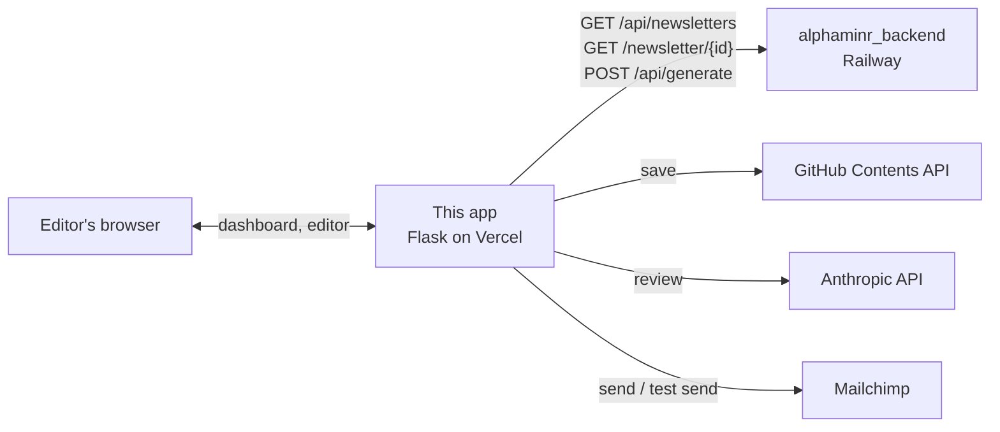

# Alphaminr Frontend

**A password-gated editor portal for the Alphaminr financial newsletter.**

This is the Flask app an editor opens to generate a newsletter, read it over, fix the copy, ask Claude for a review, and send it to the Mailchimp list. It holds no newsletter logic of its own. Generation and storage live in the sibling backend, [alphaminr_backend](https://github.com/krishivseth/alphaminr_backend), which this app calls over HTTP. The frontend is built for Vercel; the backend runs on Railway.

## What it does

- **Dashboard.** Lists every newsletter the backend knows about and has a one-click **Generate** button that asks the backend for a new issue.
- **Editor.** Opens a newsletter's HTML in TinyMCE. Saving commits the file to a GitHub repo through the Contents API, with your notes in the commit message.
- **AI review.** Strips the HTML down to text and sends it to Claude (`claude-3-haiku-20240307`) for feedback on accuracy, clarity, and reader value.
- **Send.** Inlines `static/css/newsletter.css` into the HTML with Premailer, creates a Mailchimp campaign, and either sends a test to the editor's inbox or sends to the whole list.
- **Password gate.** One shared password and a Flask session cookie. If no password is configured, the gate is off.
- **Mock mode.** `MOCK_MODE=true` stubs out generation, review, and sending so the UI can be worked on without any keys.

## How it works



Every page load asks the backend for the newsletter list or a single newsletter's HTML. Nothing is read from disk on the request path. The three integrations are optional: each one is initialised only if its package imports and its key is set, and the route returns a mock result otherwise.

## Quick start

Python 3.9 or newer.

```bash
pip install -r requirements.txt

export RAILWAY_BACKEND_URL=http://localhost:5000   # or your Railway URL
export EDITOR_PASSWORD=change-me
export SECRET_KEY=$(python3 -c 'import secrets; print(secrets.token_hex(32))')

python editor_portal.py                             # http://127.0.0.1:5001
```

To poke at the UI with no backend and no keys, set `MOCK_MODE=true` instead of the backend URL. The dashboard will be empty, but generate, review, and send all return canned responses.

To deploy, import the repo into Vercel. `vercel.json` routes everything to `editor_portal.py` under `@vercel/python` and serves `static/` and `templates/` as static files. Set the variables below in the Vercel dashboard, not in `vercel.json`. [VERCEL_ENV_SETUP.md](./VERCEL_ENV_SETUP.md) walks through it.

## Configuration

All settings are environment variables. `.env` is loaded with python-dotenv for local runs.

| Variable | Required | Purpose |
|----------|----------|---------|
| `RAILWAY_BACKEND_URL` | yes | Base URL of alphaminr_backend. Defaults to `http://localhost:5000`. |
| `EDITOR_PASSWORD` | yes | Shared login password. Unset disables login entirely. |
| `SECRET_KEY` | yes | Flask session secret. Unset also disables the login check. |
| `MOCK_MODE` | no | `true` stubs generation, review, and sending. |
| `ANTHROPIC_API_KEY` | no | Enables AI review. |
| `MAILCHIMP_API_KEY`, `MAILCHIMP_SERVER_PREFIX`, `MAILCHIMP_LIST_ID` | no | Enable sending. All three are needed for a real send. |
| `REPLY_TO_EMAIL` | no | Reply-to address on the Mailchimp campaign. |
| `EDITOR_EMAIL` | no | Recipient of test sends. |
| `GITHUB_TOKEN` | no | Enables save. Commits go to the repo named in `github_helper.py`. |

`/api/env-check` and `/api/debug-backend` report which of these are set and whether the backend answers, without exposing values.

## Routes

| Route | Purpose |
|-------|---------|
| `GET /`, `GET /login`, `GET /logout` | Dashboard and auth |
| `GET /editor/<id>` | TinyMCE editor for one newsletter |
| `POST /api/generate-newsletter` | Ask the backend for a new issue (5 minute timeout) |
| `POST /api/newsletter/<id>` | Commit edited HTML to GitHub |
| `POST /api/newsletter/<id>/review` | Claude review |
| `POST /api/newsletter/<id>/send` | Mailchimp send; `{"test_mode": true}` for a test email |
| `GET /health` | Liveness plus which optional packages imported |
| `GET /api/test`, `/api/env-check`, `/api/debug-backend`, `/api/template-debug`, `/api/debug-files`, `/api/debug-newsletter/<id>` | Debug endpoints left in from the Vercel rollout |

## Project layout

```
editor_portal.py        Flask app: auth, routes, backend calls, review, send
github_helper.py        Commit a file through the GitHub Contents API
templates/
├── base.html           Bootstrap 5 shell and nav
├── index.html          Dashboard, generate button, status and log polling
├── editor.html         TinyMCE editor with save, review, and send buttons
└── login.html
static/css/newsletter.css   Styles inlined into the email before sending
newsletters/            Sample generated issues, checked in for reference
newsletters.db          Old SQLite store, no longer read by the app
vercel.json             Vercel build and routing config
VERCEL_ENV_SETUP.md     Dashboard walkthrough for the variables above
requirements.txt
```

## Limitations

- The app is thin by design. If the backend is down, the dashboard is empty and the editor returns 404. There is no local fallback.
- `github_helper.py` hardcodes the target repo (`krishivseth/Alphaminr`, branch `main`). Change it there if your newsletters live elsewhere.
- After a successful generate, the app also tries to write the HTML into `newsletters/` and into a database. The database helpers do not exist in this repo, so that step logs an error and moves on. On Vercel the filesystem is ephemeral anyway. The backend is the source of truth.
- `/api/generation-status` and `/api/generation-logs` look for a lock file and log files that this app never writes. They are left over from an earlier version that ran generation as a subprocess and mostly report `idle` or `No logs available`.
- `/health`, `/api/test`, `/api/env-check`, `/api/debug-backend`, and `/api/template-debug` sit outside the login gate. They reveal which variables are set and the backend URL, not the values. Remove them before exposing the app more widely.
- There is one password for everyone, no user accounts, and no CSRF protection on the API routes beyond the session cookie.

## License

MIT.
